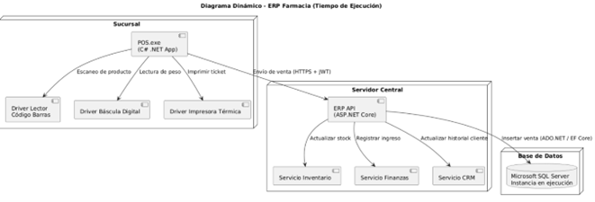

= 5. Vista de Construcción
:toc:
:sectnums:

== 5.1 Propósito
La vista de construcción describe cómo se organiza el sistema **FarmaSmart ERP (prototipo académico)** 
en bloques estáticos de software. Se representan los módulos principales y su interacción en distintos niveles de detalle.

== 5.2 Nivel 1 – Sistema y Contenedores
El sistema se compone de tres contenedores principales:
- **Frontend**: Interfaz para usuarios (administradores y empleados).  
- **Backend/API REST**: Lógica de negocio y punto central de comunicación.  
- **Base de Datos Relacional**: Persistencia de información (productos, clientes, ventas, roles, proveedores).  

== 5.3 Nivel 2 – Componentes principales del Backend
El backend se divide en módulos (bloques de construcción) que reflejan las funcionalidades clave:

- **Módulo de Autenticación y Seguridad**: Manejo de usuarios, roles y permisos.  
- **Módulo de Inventario**: Control de stock, lotes y vencimientos.  
- **Módulo de Ventas y Facturación**: Registro de ventas y generación de facturas.  
- **Módulo de Clientes y Proveedores**: CRUD de clientes y proveedores.  
- **Módulo de Integración (simulada)**: Endpoints para comunicación con contabilidad/reportes básicos.  

[Diagrama de contexto]

== 5.4 Consideraciones
- Esta vista refleja la **organización modular del backend**, sin entrar en detalle de clases individuales.  
- Los módulos se implementarán como controladores y servicios en el backend, comunicándose con la base de datos a través de DAOs/ORM.  
 

== 5.5 Resumen
La arquitectura de bloques garantiza: +
- **Separación de responsabilidades** entre los distintos módulos.  + 
- **Escalabilidad académica**: se pueden añadir nuevos módulos (ejemplo: recursos humanos o analítica) sin afectar los existentes.  +
- **Trazabilidad clara**: cada bloque corresponde a funcionalidades identificadas en el backlog del Sprint 1.  
